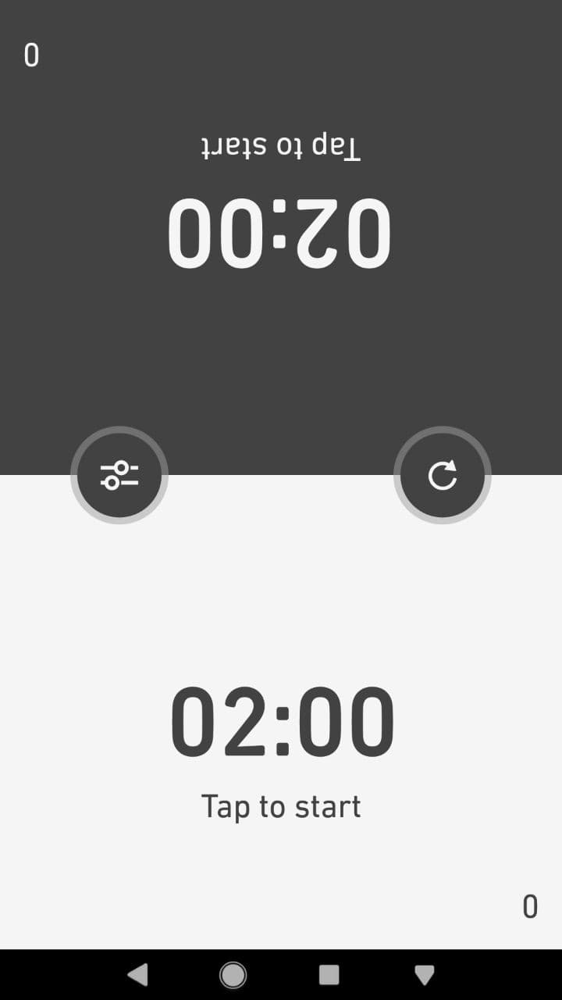
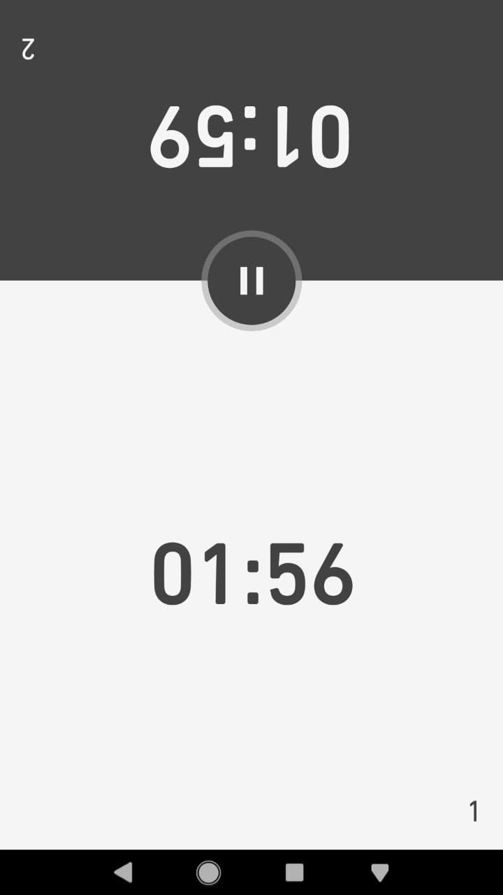
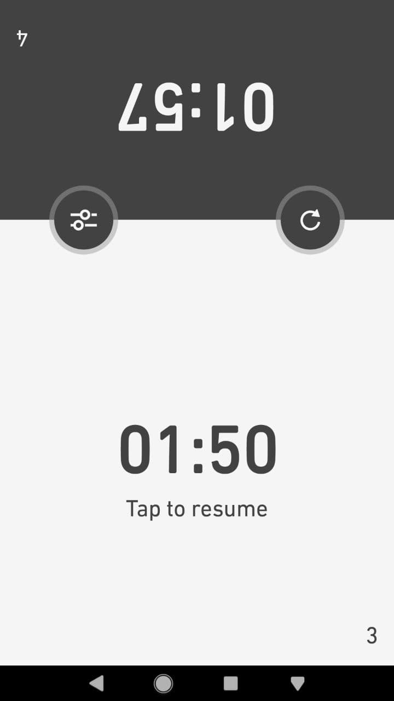
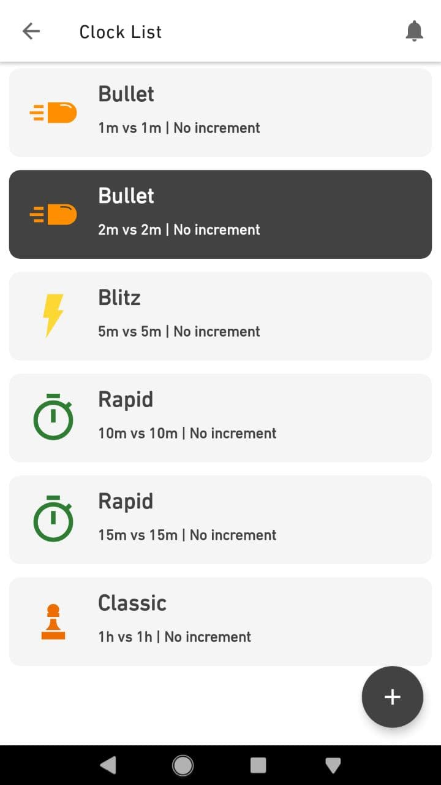
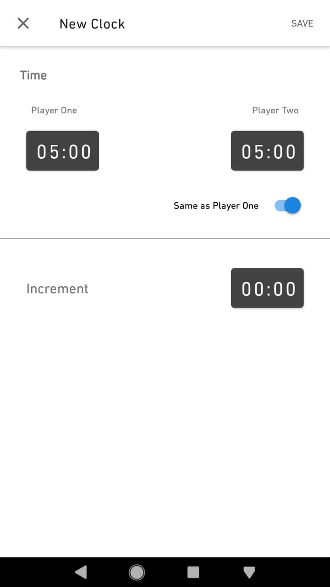

# Chess-Clock
Simple chess clock

https://play.google.com/store/apps/details?id=com.themarto.chessclock

This project is intended to put in practices some of the main concepts about Android Development nowadays.

* Implementing MVVM Architecture; ViewModel, LiveData.
* Database; Room and Kotlin Coroutines.
* Navigation Components.

----
 

